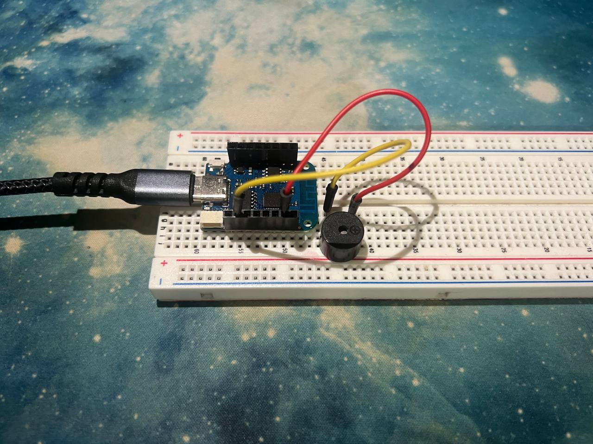

# qr-doorbell
A **simple IoT doorbell** that uses a QR code and a web interface to ring a buzzer via an ESP8266/ESP32.

## Live Demo
➡️ **[https://kokoc30.github.io/qr-doorbell/](https://kokoc30.github.io/qr-doorbell/)**

## Table of Contents
- [Features](#features)
- [QR Code](#qr-code)
- [Hardware Setup](#hardware-setup)  
  - [Components](#components)  
  - [Wiring Diagram](#wiring-diagram)
- [Software Setup](#software-setup)  
  - [Arduino Sketch](#arduino-sketch)  
  - [Web Interface](#web-interface)
- [Usage](#usage)
- [License](#license)

---

## Features
- **QR-to-ring**: Visitors scan a QR code to open a mobile-friendly web page.  
- **Press & hold**: Hold the on-screen bell for **3 seconds** to ring a physical buzzer.  
- **Self-hosted**: Static front-end on GitHub Pages, backend on the ESP8266/ESP32.

---

## QR Code
**Scan this code** with your phone to open the doorbell interface:


---

## Hardware Setup

### Components
- **Wemos D1 Mini** (ESP8266) or **ESP32** board  
- **Active buzzer** (5–12 mm cylinder)  
- **USB-C cable** for power & programming  
- **Breadboard** (optional)  
- **Jumper wires**  

### Wiring Diagram
Connect the buzzer directly to the D1 Mini:

- **Buzzer “+”** → **D2 (GPIO4)** on the D1 Mini  
- **Buzzer “–”** → **GND** on the D1 Mini  



---

## Software Setup

### Arduino Sketch
1. **Clone** this repository and open `doorbell.ino` in the Arduino IDE.  
2. **Install** the **PubSubClient** library via **Sketch → Include Library → Manage Libraries**.  
3. **Fill in** your Wi-Fi credentials:
    ```cpp
    const char* ssid = "YOUR_SSID";
    const char* pass = "YOUR_PASSWORD";
    ```
4. **Upload**, then open the **Serial Monitor** at **115200 baud** to see the assigned IP.


## Web Interface

The static front-end lives in the `gh-pages` branch and is served at the demo URL above. It uses vanilla HTML, CSS, and JS (with MQTT over WebSockets) to send `"ring"` and `"stop"` commands to your ESP.

## Usage

1. **Print** and display the sign with the QR code by your door.  
2. **Guest** scans the QR and loads the interface in their browser.  
3. **Press & hold** the 🔔 icon for **3 seconds**.  
4. The **buzzer rings** inside your home, alerting you to visitors.

## License

This project is the original work and idea of [@kokoc30](https://github.com/kokoc30).

© 2025 **kokoc30**. All rights reserved.


